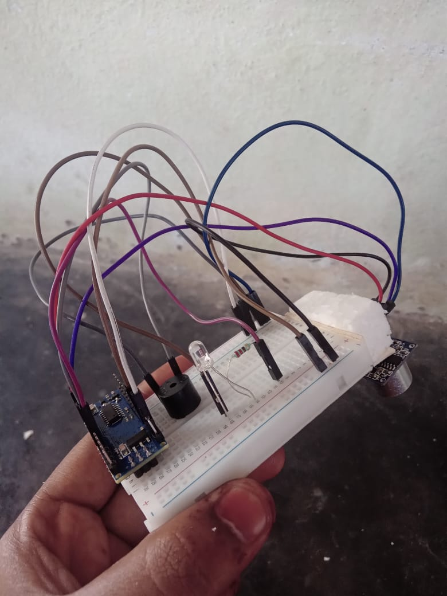
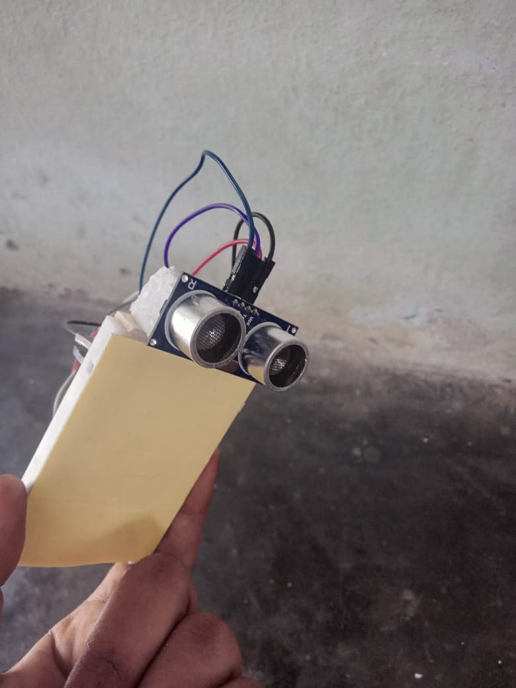

# 🗑️ Smart Waste Management System

## 📌 Project Overview
This project is a Smart Waste Management System using Arduino Nano.  
It uses an Ultrasonic Sensor to measure the garbage level inside a dustbin.  
When the bin is full, a White LED lights up and a buzzer sounds an alert.  
This system helps in monitoring waste bins automatically without manual checking.

---

## 📷 Project Images

---

## 🎥 Demo Video
<video width="480" controls>
  <source src="smartr__waste__management__arduino.mp4" type="video/mp4">
  Your browser does not support the video tag.
</video>

